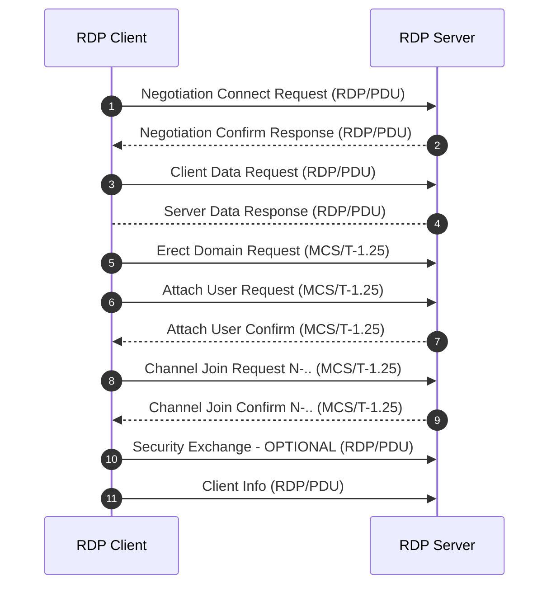

# Go-RDP
Simple Golang-based RDP-client. Structures was taken from official MS-Documentation and from repositories. Development is going at the moment. It can login to remote RDP server, to imitate mouse movement, to proccess bitmap stream to proccess image. Sounds cool! Do more research!

# Init auth flow 

# Usefull shorts

- `TCP` Transmission Control Protocol
- `TPKT` TCP Packet
- `COPT` Connection-Oriented Transport Protocol (`X224/ISO 8073`)
- `MCS` Multipoint Communication Service (`T.125`)
- `BER` Basic Encoding Rules (`ASN.1`)
- `PER` Packed Encoding Rules 
- `GCC` Generic Conference Control (`T.124`)
- `RDP` Remote Desktop Protocol (`Top level abstraction of protocol.`)
- `PDU` Protocol Data Unit 

# TODO Authorization

    [+] Negotiation proccess.
        [+] RPD security (Without any secure encryption, plain RDP-stack protocols traffic)
        [-] CredSSP
        [-] TLS
        [-] NLA
    [+] Basic settings exchange. (Without checking of certificate from server.)
    [-] Channel connection.
    [-] Security commencement.
    [-] Secure settings exchange.
    [-] Licensing.
    [-] Capabilities exchange.
    [-] Connection finalization.
    [-] Data exchange.

