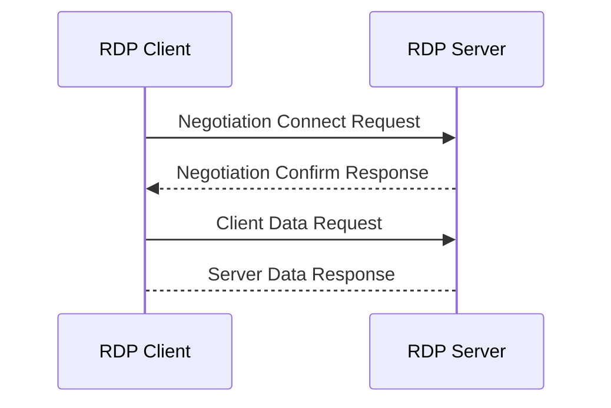

# Go-RDP

# TODO Authorization

    [+] Negotiation proccess.
        [+] RPD security (Without any secure ancryption, plain RDP-stack protocols traffic)
        [-] CredSSP
        [-] TLS
        [-] NLA
    [-] Basic settings exchange.
    [-] Channel connection.
    [-] Security commencement.
    [-] Secure settings exchange.
    [-] Licensing.
    [-] Capabilities exchange.
    [-] Connection finalization.
    [-] Data exchange.

# TODO Proccessing images and device events

# Basic flow of request, responses to set stable connection

# Usefull shorts

- `TCP` Transmission Control Protocol
- `TPKT` TCP Packet
- `COPT` Connection-Oriented Transport Protocol (`X224/ISO 8073`)
- `MCS` Multipoint Communication Service (`T.125`)
- `BER` Basic Encoding Rules (`ASN.1`)
- `PER` Packed Encoding Rules 
- `GCC` Generic Conference Control (`T.124`)
- `RDP` Remote Desktop Protocol (`Top level abstraction of protocol.`)
